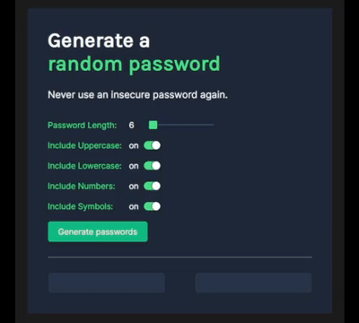

# Password-Generator
<b>With the help of this program, you can easily generate random passwords.</b>

## Strech Goals
There are some strech goals for improvement for this project:

<b>1.  Ability to set password length </b>:white_check_mark: * <!-- when checkhed :white_check_mark: -->

<b>2. Add "copy-on-click"</b> :white_check_mark:

<b>3. Toggle "symbols" and "numbers on/off"</b> :white_check_mark:

<b>EXTRAS:</b> Uppercase and lowercase switches added.

-------
*<i>Checkboxes will be checked once a task has been completed.</i>

<i>This project was a solo project that I accomplished by myself. The design idea was given by <a href="https://scrimba.com/">Scrimba</a> from a course project in the Frontend Developer Career Path.</i>
